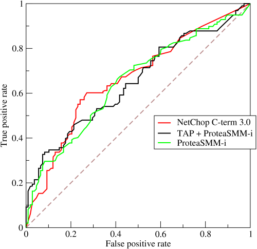

<style>

body, p, td, li, div {
  font-size: 18pt;
  color: white;
}

h1,h2,h3,h4,h5,h6 {
        text-shadow: 0 0 0 #000 !important;
  color: white;
}

.section .reveal .state-background {
   background: black;
}

span.centerImage {
     text-align: center;
}
.section .reveal h2,
.section .reveal h3,
.section .reveal p {
   color: white;
   margin-top: 50px;
}


.reveal blockquote {
  background: black;
  border-left: 10px solid #ccc;
  margin: 1.5em 10px;
  padding: 0.5em 10px;
  quotes: "\201C""\201D""\2018""\2019";
}

.reveal section del {
  color: red;
}

blockquote:before {
  color: #ccc;
  content: open-quote;
  font-size: 4em;
  line-height: 0.1em;
  margin-right: 0.25em;
  vertical-align: -0.4em;
}

blockquote p {
  display inline;
}

.reveal pre {   
  margin-top: 0;
  max-width: 95%;
  border: 1px solid #ccc;
  white-space: pre-wrap;
  margin-bottom: 1em; 
  color: black;
}

.reveal a:not(.image) {
  color: red;
  text-decoration: none;
  -webkit-transition: color .15s ease;
  -moz-transition: color .15s ease;
  -ms-transition: color .15s ease;
  -o-transition: color .15s ease;
  transition: color .15s ease; }

.reveal a:not(.image):hover {
  color: #0000f1;
  text-shadow: none;
  border: none; }

.reveal .roll span:after {
  color: #fff;
  background: #00003f; }

.reveal pre code {
  display: block; padding: 0.5em;
  font-size: 1.6em;
  line-height: 1.1em;
  background-color: white;
  overflow: visible;
  max-height: none;
  word-wrap: normal;
  color: black;
}
.reveal .state-background {
  background: black;
} 

.reveal section p {
  color: white;
}

.reveal section h1 {
  color: white;
}

.reveal section h2 {
  color: white;
}

.reveal section h3 {
  color: white;
}

</style>

<script src="http://cdn.mathjax.org/mathjax/latest/MathJax.js?config=TeX-AMS_HTML-full" type="text/javascript">
</script>

<script type="text/x-mathjax-config">
  MathJax.Hub.Config({
    "HTML-CSS": { scale: 100}
  });
</script>

Statistical Learning and Applied Modeling in Education
========================================================
Examples and Concerns
------------------------------------------------------

## **Jared Knowles**
## **01-31-2014**

Motivation
===================================================
incremental: true

- Of the two modeling cultures, we've tended to focus overwhelmingly on one
- Computation increases are changing everything
- Data is growing and many problems have different issues
- Prediction is underused and undervalued, and this undermines inference

The Data Modeling Culture
=================================

- Starts philosophically with the idea that we have written down a set of X that 
describe Y with a known functional form that we are testing
- Black box between x and y can be known because the data generating process 
DGP is some functional combination of predictors, parameters, and noise
- Model fit is based on goodness of fit and residual tests


The Algorithmic Modeling Culture
========================================

- Black box is unknowable - we are not modeling nature but seeking to use similar 
inputs to predict the outputs of the natural process
- Model fit measured by prediction accuracy


The Wisconsin Dropout Early Warning System
===============================================
type: section

> "To help keep all kids on a path to graduation, we just delivered - with no new funding - a new statewide Dropout Early Warning System, called DEWS, to all districts. DEWS makes it possible to identify kids who may be at risk, and allows districts to intervene as early as middle school." ~ Tony Evers

DEWS
========================================================

- The Dropout Early Warning System for the Wisconsin Department of Public Instruction
- Leverages DPI's administrative records to provide predictions on student high school 
completion while students are in middle grades
- Communicates the results to school staff in all Wisconsin public schools serving 
students in the middle grades
- Comes with an interpretive guide and strategies for success [available online](http://wise.dpi.wi.gov/wise_dashdews)
- Released in September of 2013, with bi-annual updates in April and August
- Serves as a good example of where social science and applied modeling intersect

Why DEWS?
========================================================

- Every child a graduate, college and career ready -- Agenda 2017, DPI's strategic 
plan
- DEWS focuses on providing schools and districts an **early** notice of 
whether or not a student is likely to complete high school on time
- DEWS uses data on historical cohorts of students in Wisconsin to link middle 
grade student outcome data with the long-term outcome of on time graduation
- DEWS provides a **relatively accurate** assessment of the likelihood of 
on time graduation for individual students across the state


Graduation and Droput By the Numbers
============================================

9,092 **students in 2010-11 did not graduate with their cohort.**

| Group | Expected | Grads  |  Rate  | Difference | 
| --------- | ------ | -----| -------|  --------: |
| White     | 54,468 | 49,783  | 91.4% | -    |
| American Indian | 1,027 | 737| 71.7% | **19.7** |
| Asian     |  2,517 | 2,225   | 88.4% | **3**    |
| Black     |  6,889 | 4,395   | 63.8% | **27.6** |
| Hispanic  |  4,751 | 3,420   | 72.0% | **19.4** |
| Total     | 69,652 | 60,560  | 86.9% | -    |


What is DEWS? 
=========================================================
incremental: true

DEWS is an applied statistical model that combines several major features:

- Data import, filtering, and cleaning for analysis from the state longitudinal 
database
- A machine learning algorithm to search for the best predictive model
- A prediction routine to apply models to current students
- An exporting feature to push predictions into the state business intelligence 
tool, WISEdash for Districts
- A display layer available to schools and districts securely for exploring the results
- In reality, it resembles **software** as much as a statistical analysis


Under the Hood of DEWS
=========================================================
incremental: true

DEWS consists of several sub-routines that can be thought of as states of building 
a statistical model

1. Data acquisition
2. Data cleaning, normalizing, and standardizing
3. Model feature and model algorithm search
4. Model testing
5. Model selection
6. New case scoring
7. Prediction export for reporting

All modules are built in the free and open source statistical computing language, [R](http://www.r-project.org/). 

DEWS by the Numbers
=====================================================
- <small>Analyzes over **250,000** historical records of student graduation
- Provides predictions on over **180,000** students in the state
- Produces predictions on students in over **1,000** schools
- Selects from over **50** candidate statistical models **per grade**
- Hundreds of users have accessed thousands of individual student reports across 
nearly every Wisconsin school district
- [Working on open sourcing the code](www.github.com/jknowles)
- Being explored in Michigan, New Jersey, and school districts in Kansas, Montana, 
and Minnesota
</small>

DEWS as an Applied Model
====================================
type: section

Data and Computing Trends
======================================================

- Available data in education is growing astronomically. 
- People are talking about things like "data science" and "big data" [even NSF](http://www.nsf.gov/cise/news/bigdata.jsp).
- Data sources are shifting from national surveys to administrative records
- More data = more problems; more data + more sources = more problems$^{2}$

Increased Computational Power
======================================================================


<small> Increased data size and complexity leads to new problems that increased 
computational power often helps to solve.</small>

Examples of Challenges and Solutions Posed by Computation
===========================================================
- <small>Bigger datasets have highly complex structures to them such as deep hierarchies, 
cross classifications, and high collinearity
  - Methods like HLM have difficulty scaling to 3, 4, or 5 levels that may exist 
  within a statewide data system
  - Cross-nested and cross-classified observations are common in observational data, 
  and difficult to deal with for many approaches
  - Alternative methods like Bayesian mixed effect regression or regression trees 
  are more CPU intensive, but more flexible
  - With 12 regions, 72 counties, 424 districts, 2,200 schools, and tens of thousands 
  of classrooms and hundreds of thousands of students the modeling data structure is complex
</small>

Straining our Generalized Linear Models
==============================================
- <small>Increased number of predictors allows us to build models of complex group interactions 
that separate
- Parameter estimates of demographic indicators are invalid when the demographic 
indicator is not observed in each outcome category (they are perfectly collinear)
- Quasi-separation can occur when this is close
- Corrections exist to adjust for the fact that maximum likelihood estimates 
are invalid in this case (Bayesian estimates, Firth bias-correction)
- Again, leveraging computation to address a problem of increased data complexity
</small>

DEWS
==================================================

- DEWS data has a complicated hierarchical structure
- DEWS data has rare cases that have to be addressed (e.g. blind students) across 
most indicators
- Using CPU-intensive techniques can work, but is not limitless -- some models 
are too slow to developed, modified, evaluated, and implemented
- As it is, DEWS takes about 48 hours to build data and models, test them, 
select the winners, and produce predictions for current students
- But in the future... who knows?


Being a Modeling Pluralist
=============================================
type: section

> Schools of statistical thoughts are sometimes jokingly likened to religions. This analogy is not perfect - unlike religions, statistical methods have no supernatural content and make essentially no demands on our personal lives. Looking at the comparison from the other direction, it is possible to be agnostic, atheistic, or simply live one's life without religion, but it is not really possible to do statistics without some philosophy. ~ Andrew Gelman


What is a statistical model?
===============================

- "All models are wrong, some models are useful" ~ George Box
- Statistical models are mathematical summaries of correlations and probabilities 
of known data
- Being wrong is a **feature of a statistical model**, the goal is to explain 
as much data as possible with as few variables as possible
- The most common in the social sciences is the linear regression model
- Sometimes the goal is **inference** and other times it is **prediction**


Statistical Modeling
=======================================================

It is useful to remember that in all statistical modeling we are looking at the
following relationship:

$$ \hat{Y} = \hat{f}(X) $$

In this case $\hat{f}$ represents our estimate of the function that links $X$ and 
$Y$. In traditional linear modeling, $\hat{f}$ takes the form:

$$ \hat{Y} = \alpha + \beta(X) + \epsilon $$

However, there exist limitless alternative $\hat{f}$ which we can explore. Applied modeling techniques help us expand the $\hat{f}$ space we search within.


Functional forms
==============================


<small>Figure adapted from James et al. 2013 (figure 2.7)</small>

Buyer Beware
===========================================
type:section

> A big computer, a complex algorithm and a long time does not equal science. ~ Robert Gentleman


Statistical Learning or Statistical Inference?
=================================================================

The line between statistical learning and statistical inference has always been 
blurry and unclear. A few questions can help:

- <small>Am I interested in accurately estimating unobserved observations based on what 
I have learned in my sample?
- Am I interested in the relationships among the parameters in my sample because 
of a theory I am testing, or because of how they can explain an outcome I am 
interested in?
- Is the data I am using common and relatively untransformed? Will new data be 
created regularly that I can fit the same model to and update?
</small>

Why the Difference?
========================================================

Algorithmic Models:

- Provide information to users about what to expect given certain data
- Serve many goals including prediction of non-observed 
outcomes, summarizing large datasets, measuring uncertainty
- Goals for the model are defined by explicit tradeoffs

***

Data Models: 

- Focused on understanding patterns in the current data
- Seek to understand how current data extrapolates to a population
- Estimates population parameters from sample data about relationships between 
inputs and outputs

Predicting Dropout
=====================================================

Algorithmic Models:
<small>
- Data: Regularly collected at specific timepoints, standardized
- Many cohorts with common data
- Interested in learning which students today are likely to dropout in the future
- Want: Confident predictions on likely graduation of new students, used to decide how
to allocate resources and services to students
</small>

***

Data Models:
<small>
- Data: national survey data, unlikely to be collected on future observations 
- One cohort is followed in the data set
- Interested in learning if social and emotional concerns are more important than 
academic success in predicting graduation
- Want: unbiased and precise estimates of parameters and if possible ability to make 
causal claims
</small>

On Prediction
===================================================

- Note that prediction is important in both cases
- In data models, making a good prediction is the sign that our theory has 
explanatory power
- In algorithmic models, making a good prediction is a sign that we have approximated 
the natural process correctly
- In both cases, we should care deeply about prediction and think carefully about 
measuring it

On Nails, Hammers, and Models
===================================================
type: section

> The best available solution to a data problem might be a data model; then again
it might be an algorithmic model. The data and the problem guide the solution. To 
solve a wider range of data problems, a larger set of tools is needed. ~ Leo Breiman

Some Vocabulary
========================================================

- Training data
- Test data
- Bias (error)
- Variance (error)


***

- Data the model is fit to (analytical sample)
- Data the model predicts, to evaluate model fit
- Refers to the amount of error due to simplifying a complex process
- The amount the $f$ would change if fit to a different training set of data


The Challenge
=================================

- When using a statistical model to make predictions we have to think clearly 
about the data we use to build the model, and the data we will be making 
predictions about
- We may build a model with high **internal validity** for the data at hand, 
but that data may not be representative of the data the model will apply to
- We call this the **training error** and the **test error**
- In inferential statistics we often seek to reduce **training error** and not 
concern ourselves with **test error**
- In applied modeling we focus on finding the optimal tradeoff between **variance** and **bias** 
in order to reduce **test error**


A Simple Motivating Example
=================================


Forecasting Apple Stock Could be Useful
===========================================

- Fit a model on the earlier part of the data (in blue)


Forecasts Are Tricky
========================

- Fit another model on the middle part of the data (purple)


Evaluating Model Fit
==================================================

How do we know how well our models fit? A **very brief** model comparison review:

- $\\R^2$ - ratio of explained variation to total variation (generally)
- Nested model tests: 
  * F test and Likelihood ratio tests (restricted and unrestricted model)
- Same sample tests:  
  * AIC, BIC, etc. (different penalties for model parameters)
- These don't give us a sense of how the model will do on **new** data, and they 
are not easy to explain!


Predicting New Data
================================================

- Test both models on the full data!


The Bias - Variance Tradeoff
=============================================

- The purple and blue models are identical except each was "trained" on different 
data, the difference between their predictions is **variance**
- Both have the less bias on the data they are trained, but the linear model 
  has a different bias - a feature of the flexibility in the model
- Less flexible models like linear models will have more bias, but are less 
variable in response to the data they are trained on
- How do we pick the model? We think about which model fits our application best


Model fit = Fit to signal + fit to noise
============================================

- Training data (sample) can lead to model overfit (the blue line)
  - Non-linear behaviors can be right around the corner
- Training data can lead to bias in future predictions (the purple line)
  - Time changes things and the process/logic of updating models is important
- We need both methods of $f$ and methods of evaluating models that 
can insulate against overfit and reduce bias
- This means different measures of model fit to choose among competing models


Bias, Variance, Training, and Test Data
======================================

<small>Figure from Hastie, Tibshirani and Friedman (2009). Springer-Verlag (Figure 7.1) </small>


Measuring Fit Differently
=============================

1. Define a metric of accuracy (ROC, AUC, kappa, RMSE, etc.)
2. Define a strategy to estimate test data accuracy/error
3. Perform the test, sensitivity checks


Metrics of Model Fit
===============================

- In the continuous case, Root Mean Square Error (RMSE)
- In the discrete case, there are a number of options including kappa, 
ROC, AUC, and others
- ROC: Receiver Operating Characteristic, AUC: Area Under the (ROC) Curve
- Many of these metrics can be extended to the multi-class case as well

Confusion Matrix
======================
<table>
  		<tr>
				<td colspan="2" rowspan="2"></td>
				<td colspan="2" style="background-color:#1b85b8; border: 2px solid #aaa">Actual</td>			
			</tr>
			<tr>
				<td>Non-grad</td>
				<td>Graduate</td>
			</tr>
			<tr>
				<td rowspan="2" style="background-color:#ae5a41; border: 2px solid #aaa">Predicted</td>
				<td>Non-grad</td>
				<td><b>a</b></td>
				<td><b>b</b></td>
			</tr>
			<tr>
				<td>Graduate</td>
				<td><b>c</b></td>
				<td><b>d</b></td>
			</tr>
		</table>
    
Some performance metrics we can use:
- Accuracy: $\frac{(a+d)}{(a+b+c+d)}$
- Precision (positive predictive value) = $\frac{a}{(a+b)}$
- Sensitivity (recall) = $\frac{a}{(a+c)}$
- Specificity (negative predictive value) = $\frac{d}{(b+d)}$
- False alarm (1-specificity) = $\frac{b}{(b+d)}$

Confusion Matrix
======================
<table>
      <tr>
				<td colspan="2" rowspan="2"></td>
				<td colspan="2" style="background-color:#1b85b8; border: 2px solid #aaa">Actual</td>			
			</tr>
			<tr>
				<td>Non-grad</td>
				<td>Graduate</td>
			</tr>
			<tr>
				<td rowspan="2" style="background-color:#ae5a41; border: 2px solid #aaa">Predicted</td>
				<td>Non-grad</td>
				<td  style="background-color:#c3cb71; border: 2px solid #ead61c"><b>a</b></td>
				<td><b>b</b></td>
			</tr>
			<tr>
				<td>Graduate</td>
				<td><b>c</b></td>
				<td style="background-color:#c3cb71; border: 2px solid #ead61c"><b>d</b></td>
			</tr>
		</table>
    

Accuracy: $\frac{(a+d)}{(a+b+c+d)}$

Accuracy is a good measure if our classes are fairly balanced and we care about 
overall correctly dividing the data into the groups. 

If one group is much larger than another though, this method can be misleading.

Confusion Matrix
======================
<table>
    	<tr>
				<td colspan="2" rowspan="2"></td>
				<td colspan="2" style="background-color:#1b85b8; border: 2px solid #aaa">Actual</td>			
			</tr>
			<tr>
				<td>Non-grad</td>
				<td>Graduate</td>
			</tr>
			<tr>
				<td rowspan="2" style="background-color:#ae5a41; border: 2px solid #aaa">Predicted</td>
				<td>Non-grad</td>
				<td  style="background-color:#c3cb71; border: 2px solid #ead61c"><b>a</b></td>
				<td  style="background-color:#c3cb71; border: 2px solid #ead61c"><b>b</b></td>
			</tr>
			<tr>
				<td>Graduate</td>
				<td><b>c</b></td>
				<td><b>d</b></td>
			</tr>
		</table>
    

Precision (negative predictive value) = $\frac{a}{(a+b)}$

- Of all the cases we predict to be **non-graduates**, what proportion actually graduate?
- If we are interested in the **non-graduate** class, then this is a very useful metric 
to understand how good we are at identifying this group. Useful if this class is a rare 
class.

Confusion Matrix
======================
<table>
      <tr>
				<td colspan="2" rowspan="2"></td>
				<td colspan="2" style="background-color:#1b85b8; border: 2px solid #aaa">Actual</td>			
			</tr>
			<tr>
				<td>Non-grad</td>
				<td>Graduate</td>
			</tr>
			<tr>
				<td rowspan="2" style="background-color:#ae5a41; border: 2px solid #aaa">Predicted</td>
				<td>Non-grad</td>
				<td  style="background-color:#c3cb71; border: 2px solid #ead61c"><b>a</b></td>
				<td ><b>b</b></td>
			</tr>
			<tr>
				<td>Graduate</td>
				<td style="background-color:#c3cb71; border: 2px solid #ead61c"><b>c</b></td>
				<td><b>d</b></td>
			</tr>
		</table>
    

Sensitivity (recall) = $\frac{a}{(a+c)}$

- Of all the **non-graduate** cases, what percentage do we correctly identify (recall)?
- Useful if we are interested in rare-event models where we want to accurately 
identify rare events, and are less worried about how accurate we are with the modal 
or common case. 

Confusion Matrix
======================
<table>
      <tr>
  			<td colspan="2" rowspan="2"></td>
				<td colspan="2" style="background-color:#1b85b8; border: 2px solid #aaa">Actual</td>			
			</tr>
			<tr>
				<td>Non-grad</td>
				<td>Graduate</td>
			</tr>
			<tr>
				<td rowspan="2" style="background-color:#ae5a41; border: 2px solid #aaa">Predicted</td>
				<td>Non-grad</td>
				<td><b>a</b></td>
				<td style="background-color:#c3cb71; border: 2px solid #ead61c"><b>b</b></td>
			</tr>
			<tr>
				<td>Graduate</td>
				<td><b>c</b></td>
				<td style="background-color:#c3cb71; border: 2px solid #ead61c"><b>d</b></td>
			</tr>
		</table>
    

Specificity (positive predictive value) = $\frac{d}{(b+d)}$

False alarm (1-specificity) = $\frac{b}{(b+d)}$

- Of all the **graduate** cases, what proportion actually do we predict correctly?
- If we are interested in one class, this metric is either interesting on its own, 
or as the balancing metric (false alarm) that we seek to hold constant while 
increasing our sensitivity. 

Receiver Operating Characteristic
====================================



- <small>ROC represents the tradeoff between the fraction of non-graduates identified out of 
all non-graduates, and the fraction of false non-graduates out of all graduates </small>

***

- <small>Can represent the variation in classification accuracy as the discrimination threshold 
is varied
- Can support decision analysis by allowing a decision to be made explicitly about the 
balance between false-positives and false-negatives
- Excellent for optimizing rare-class identification
</small>

Estimating the Test Error
================================

- In cases where observations are cheap, 50% of the sample is for training, 25% 
for validation, and 25% for final testing
- When data are not cheap, a number of methods can be used to approximate the 
test set error
- K fold cross-validation splits the data into 5 groups, and uses each group 
1 time as a validation set, fitting the model to the other 4 groups
  *  "Overall, <U+FB01>ve- or tenfold cross-validation are recommended as a good compromise..." Hastie et al p. 243
- Alternatives include bootstraps, leave one out cross-validation, leave-group-out cross validation, out-of-bag estimates

Summary of Methods
================================================
<table>
<tr>
<th>Method</th>
<th>Data Loss</th>
<th>External Validity</th>
</tr>
<tr>
<td>Hold 1 Cohort Out</td>
<td>Highest</td>
<td>Highest</td>
</tr>
<tr>
<td>Random Sample from Multiple Cohorts</td>
<td>High</td>
<td>Higher</td>
</tr>
<tr>
<td>Simple Random Sample in Training Data</td>
<td>Moderate</td>
<td>Low</td>
</tr>
<tr>
<td>Stratified Sample Within Training Data</td>
<td>Moderate</td>
<td>High</td>
</tr>
<tr>
<td>Repeated Fold Cross-Validation</td>
<td>Low</td>
<td>Moderate</td>
</tr>
</table>

<small> The method used for estimating the test error is arguably more important 
than the selection of the algorithm being tested. </small>

Model Fit: Predicting Dropouts
==================================================


<small>Adapted from Bowers and Sprott 2013</small>

Problems
=================================================

- Most EWIs have a low true positive identification rate
- EWI literature does not report performance on a test dataset of future students
- High performing EWIs have immense data requirements
- Alarming false positive rates and no ability to tune these rates due to 
single indicator
- But... we have a strong baseline universe to compare to

Evaluating Multiple DEWS Candidate Models Using ROC
=====================================================


AUCs Across Methods
==================================================


```
processing file: AppliedModelingTalk.Rpres
Loading required package: ggplot2
Loading required package: xts
Loading required package: zoo

Attaching package: 'zoo'

The following objects are masked from 'package:base':

    as.Date, as.Date.numeric

Loading required package: TTR
Version 0.4-0 included new data defaults. See ?getSymbols.
    As of 0.4-0, 'getSymbols' uses env=parent.frame() and
 auto.assign=TRUE by default.

 This  behavior  will be  phased out in 0.5-0  when the call  will
 default to use auto.assign=FALSE. getOption("getSymbols.env") and 
 getOptions("getSymbols.auto.assign") are now checked for alternate defaults

 This message is shown once per session and may be disabled by setting 
 options("getSymbols.warning4.0"=FALSE). See ?getSymbols for more details.
Quitting from lines 1030-1045 (AppliedModelingTalk.Rpres) 
Error: stat_count() must not be used with a y aesthetic.
In addition: Warning messages:
1: In download.file(paste(yahoo.URL, "s=", Symbols.name, "&a=", from.m,  :
  downloaded length 169393 != reported length 200
2: aes_auto() is deprecated 
3: aes_auto() is deprecated 
4: aes_auto() is deprecated 
5: aes_auto() is deprecated 
6: `stat` is deprecated 
Execution halted
```
