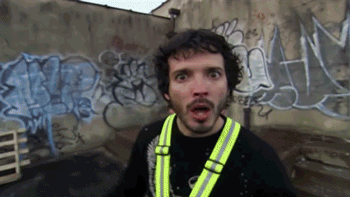
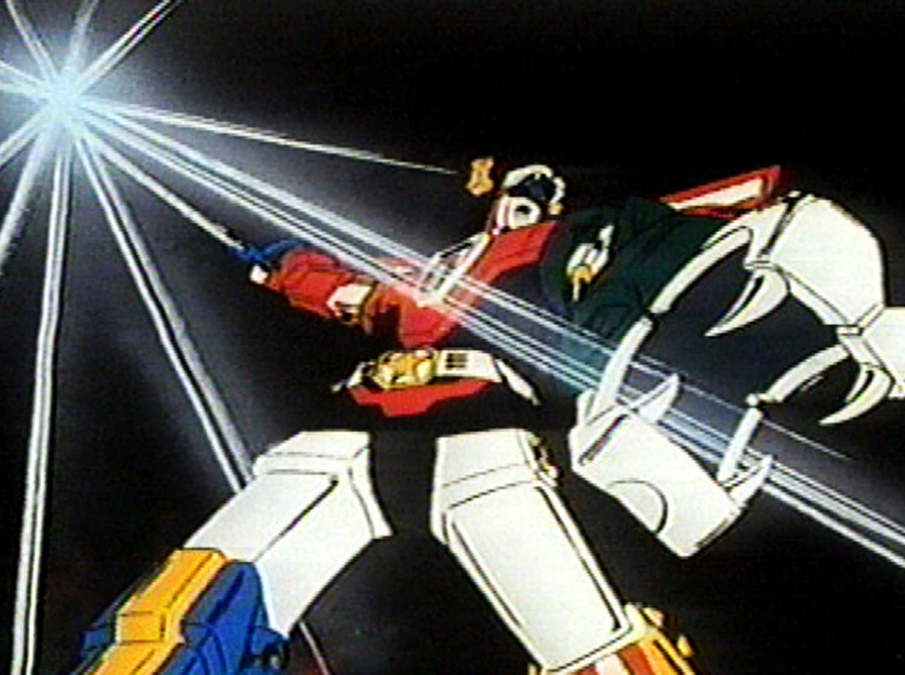

```{r setup, echo=FALSE, warning=FALSE, message=FALSE}
library(knitr)
opts_chunk$set(dev="png", echo=FALSE, warning=FALSE, message=FALSE, dpi=68, 
               fig.width=8, fig.height = 6)
```

## Machine Learning and Government

### The good

- Understanding large administrative data becomes better, faster, cheaper, etc.
- Social processes full of non-linearities, interactions, feedback

### The danger

- Hinders transparency
- Mathematical models can have unintended consequences


## Wisconsin Dropout Early Warning System - DEWS

```{r echo=FALSE, fig.align='center', fig.height=7, fig.width=9.5}
library(png)
library(grid)
img <- readPNG("img/DEWS_workflow_diagram.png")
grid.raster(img)
# <div style="width:300px; height:200px; align:center">
# 
# </div>
```

## Context


- Wisconsin Department of Public Instruction is the state K-12 education 
agency
- Historically charged with regulating public schools and reporting on school 
conditions


## Why Public Sector is Different

> Many, if not most, of the difficulties we experience in dealing with government 
agencies arise from the agencies being part of a fragmented and open political 
system... The central feature of the American constitutional system—the separation 
of powers—exacerbates many of these problems. The governments of the US were not 
designed to be efficient or powerful, but to be tolerable and malleable.

~ James Q. Wilson


## The Promise of Machine Learning in Education

> - Educators are facing a work environment that is increasingly complex, data 
rich, and time/labor intensive
> - Performance measures, accountability pressure, and a desire to understand 
student progression have created a proliferation of data
> - Many schools and school districts are unable to devote resources to data analysis
> - Data is collected, stored, and reported -- but often not able to be used to 
assist educators


## DEWS by the Numbers

- Analyzes over **500,000** historical records of student graduation
- Selects from over **50** candidate statistical models **per grade**
- Provides biannual predictions on over **240,000** current students across four grades 
to over **1,000** schools 
- Hundreds of users have accessed thousands of individual student reports across 
nearly every Wisconsin school district

## The Process of Building DEWS

- Identify the problem
- Assemble a team
- Demonstrate a prototype
- Iterate and improve
- Deploy

## Identification

> It's better to solve the right problem approximately than to solve the 
> wrong problem exactly 

~ John Tukey

## Strategies for Identification

> - Find policy relevant project with engaged leadership
> - Seek out existing solutions and identify strength and weaknesses
> - Focus on a space where a solution will be well received
> - Align solution to perceived needs


## The Dropout Problem


## Agree on Values

- Set clear expectations about tradeoffs and be honest about solution
- Use shared goals to ground work as more people participate in the project
- Use values to assess techncial trade-offs and resolve them


## What do we want from an EWS?

>- **Accurately** identifying students who need assistance and those who do not
>- **Timely** identification to make interventions
>- **Transparency** in how predictions were made and how students are labeled
>- **Reproducibility** in the predictions so they vary with changes in underlying behaviors 
not the models
>- **Scaleable** to a diverse array of student and school contexts


## Accuracy First 

**Opportunity cost**

>- 1,000 schools receiving on average 240 predictions each. 
>- Each prediction reviewed by 3-5 staff for ~5 minutes
>- 3 x 240 x $\frac{1}{12}$ = 60 hours
>- 5 x 240 x $\frac{1}{12}$ = 100 hours
>- Across 1,000 schools thats 60,000 to 100,000 hours of annual work 

## Demonstrate Potential


## Show Early Success

- Focus on your pitch and how to talk about your prototype
- Find and engage with internal champions
- Graciously get feedback


## Prototype

- Can be crude, but must show potential


## Communicate


- Strut! Be positive and enthusiastic about your work
- Work hard on finding language others can use to talk about project
- Avoid talking technical; focus on potential
- Adjust your message to each audience, tell them what project does for them
- Remember - skepticism and doubt are valid responses


## Empower Feedback

- Show the project in a familiar context
- Avoid jargon and focus on results
- Frame discussion of project to specific skills, goals, needs of audience
- Frame results in terms relevant to broader discussions

## Framing Results {.flexbox .vcenter}

<small>Adapted from Bowers, Sprott, and Taff 2013</small> 

```{r ewslitplot, fig.align='center', fig.height=7, fig.width=9.5}
library(png)
library(grid)
img <- readPNG("img/ewsLITplot2.png")
grid.raster(img, interpolate = TRUE)
```

## Framing Results {.flexbox .vcenter}

```{r prototypeplot, fig.align='center', fig.height=7, fig.width=9.5}
img <- readPNG("img/alternativemodels-1.png")
grid.raster(img, interpolate = TRUE)
```

## Feedback on Prototype



- Accuracy is paramount
- Transparency is less critical if results linked to trusted data
- Communication a greater concern than technical challenges
- IT staff prove to be key allies

## Assemble



## Working Alone


### Just Don't!

- Organizational change takes people
- It takes an array of skills no one person has
- Multiple people make project robust to organizational changes

## Self-reflection


- What skills do you have? What skills do you need?
- Where can you find those skills?
- What will motivate people to contribute to this project?

## Structuring Your Team

```{r 3by3, fig.align="center", fig.width = 9.5, fig.height =7}
plotdf <- expand.grid(tech = c("Technical", "Substantive"), 
                      depth = c("Active", "Passive"), 
                      stakeholder = c("Internal", "External"))

plotdf$y <- 0
library(ggplot2)

ggplot(plotdf, aes(y = y)) + facet_grid(stakeholder ~ tech + depth) + 
  theme_bw(base_size = 20) + 
  labs(x = "", y = "", title = "Model of Stakeholders") +
  theme(axis.text.y = element_blank(), 
        panel.grid = element_blank(), 
        axis.ticks.y = element_blank())

```

## Engagement

- Team members need tasks they can succeed at
- Input needs to be heard, reviewed, and acted on
- Process needs to be transparent and clear to key audiences
- Need leadership to continually reinforce this work
- This takes time!

## Agree on Roadmap


## Build a Roadmap

- Set internal deadlines and regular check-ins with leadership
- Agree on a release date early to avoid "analysis paralysis"
- Plan back from release date including communications, documentation, and 
support materials
- Build in time for team members to change roles, join, or leave

## Iterate


## Public Context Differs

- Develop a pilot program if at all possible
- Use feedback and encouragement from stakeholders to show progress to leadership
- Slowly expand the circle of trust
- Prepare for presentation to senior officials if necessary


## Show Improvement


## Prepare for Final


## Final


## Deploy


## The DEWS Workflow

```{r echo=FALSE, fig.align='center', fig.height=7, fig.width=9.5}
library(png)
library(grid)
img <- readPNG("img/DEWS_workflow_diagram.png")
grid.raster(img)
# <div style="width:300px; height:200px; align:center">
# 
# </div>
```

## But...


## Maintenance


- Who updates what when things change?


## Monitoring

- Track what the strengths and weaknesses are
- Is the application too complex and sensitive to operational changes?
- What systems is the application dependent on? 
- What systems have become dependent on the application?


## Review and Revisit

- Agree up front to this as part of the roadmap
- Set key check-ins and specify the purpose
- Focus back on the core values
- Refresh membership and invite new perspectives


## What's Next in Wisconsin

- Starting this process for a new analytic tool assessing college and career 
readiness
- Studying impact of DEWS and integrating DEWS into more agency communication 
to boost visibility
- Further enhance DEWS codebase to integrate with enterprise information systems

## Contact Info

- DEWS Homepage: [http://www.dpi.wi.gov/dews](http://www.dpi.wi.gov/dews)
  + You can read about technical background and find code and communications 
  surrounding the application here
- E-mail: jknowles@gmail.com
- GitHub: [http://www.github.com/jknowles](http://www.github.com/jknowles)
- Homepage: [www.jaredknowles.com](http://www.jaredknowles.com/)
- Twitter: @jknowles


## What is DEWS? {.smaller}

DEWS is an applied statistical model that combines several major features:

>- Data import, filtering, and cleaning for analysis from the state longitudinal 
database
>- A machine learning algorithm to search for the best predictive model
>- A prediction routine to apply models to current students
>- An exporting feature to push predictions into the state business intelligence 
tool, WISEdash for Districts
>- A display layer available to schools and districts securely for exploring the results
>- In reality, it resembles **software** as much as a statistical analysis


## Under the Hood of DEWS {.smaller}

DEWS consists of several sub-routines that can be thought of as states of building 
a statistical model

1. Data acquisition
2. Data cleaning, normalizing, and standardizing
3. Model feature and model algorithm search
4. Model testing
5. Model selection
6. New case scoring
7. Prediction export for reporting

All modules are built in the free and open source statistical computing language, [R](http://www.r-project.org/). 
