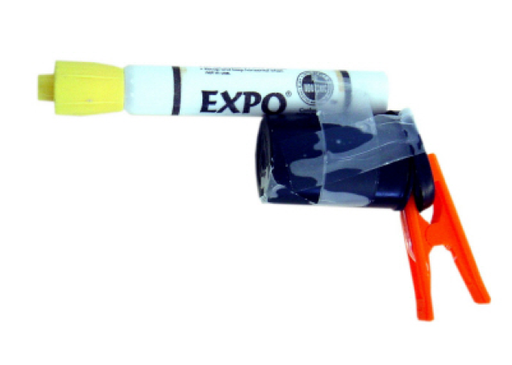

```{r setup, echo=FALSE, warning=FALSE, message=FALSE}
library(knitr)
opts_chunk$set(dev="png", 
               echo=FALSE, warning=FALSE, message=FALSE, dpi=68)
```

## The Promise of Machine Learning in Education

- Educators are facing a work environment that is increasingly complex, data 
rich, and time/labor intensive
- Performance measures, accountability pressure, and a desire to understand 
student progression have created a proliferation of data
- Many schools and school districts are unable to devote resources to data analysis
- Data is collected, stored, and reported -- but often not able to be used to 
assist educators

**This is the promise**

## Setting the Context

- Background on DEWS
- Based on experience of deploying a machine learning application to all school 
districts in the state of Wisconsin
- Focus on the challenges of successful implementation and deployment unique to 
this government context

## About DEWS

- DEWS is the Wisconsin Dropout Early Warning System
- DEWS 

## What do we want from an EWS?
- **Early** identification in time to make interventions
- **Accurately** identifying students who need assistance and those who do not
- **Transparency** in how predictions were made and how students are labeled
- **Reproducibility** in the predictions so they vary with changes in underlying behaviors 
not the models
- **Scaleable** to a diverse array of student and school contexts


## What is DEWS? {.smaller}

DEWS is an applied statistical model that combines several major features:

>- Data import, filtering, and cleaning for analysis from the state longitudinal 
database
>- A machine learning algorithm to search for the best predictive model
>- A prediction routine to apply models to current students
>- An exporting feature to push predictions into the state business intelligence 
tool, WISEdash for Districts
>- A display layer available to schools and districts securely for exploring the results
>- In reality, it resembles **software** as much as a statistical analysis


## Under the Hood of DEWS {.smaller}

DEWS consists of several sub-routines that can be thought of as states of building 
a statistical model

1. Data acquisition
2. Data cleaning, normalizing, and standardizing
3. Model feature and model algorithm search
4. Model testing
5. Model selection
6. New case scoring
7. Prediction export for reporting

All modules are built in the free and open source statistical computing language, [R](http://www.r-project.org/). 

## DEWS by the Numbers {.smaller}

- Analyzes over **350,000** historical records of student graduation
- Provides predictions on over **240,000** current students, in four grades, in the state
- Produces predictions on students in over **1,000** schools
- Selects from over **50** candidate statistical models **per grade**
- Hundreds of users have accessed thousands of individual student reports across 
nearly every Wisconsin school district
- Open sourced


## The DEWS Workflow

```{r echo=FALSE, fig.align='center', fig.height=7, fig.width=9.5}
library(png)
library(grid)
img <- readPNG("img/DEWS_workflow_diagram.png")
grid.raster(img)
# <div style="width:300px; height:200px; align:center">
# 
# </div>
```


## Why accuracy? 

**Opportunity cost**

>- Accuracy matters tremendously at scale. 
>- 1,000 schools receiving on average 240 predictions each. 
>- Each prediction reviewed by 3-5 staff for ~5 minutes
>- 3 x 240 x $\frac{1}{12}$ = 60 hours
>- 5 x 240 x $\frac{1}{12}$ = 100 hours
>- Across 1,000 schools thats 60,000 to 100,000 hours of work 
>- This could cost from $1 million to $4 million annually


## How did DEWS get done?

- Identify the problem
- Assemble a team
- Demo your product
- Iterate
- Deploy

## Identification

> It's better to solve the right problem approximately than to solve the 
> wrong problem exactly 

~ John Tukey

## Strategies for Identification

- Find policy relevant project with engaged leadership
  - Leadership will need to advance project and focus resources
- Seek out existing solutions and identify strength and weaknesses
  - Must always be better than off the shelf
- Focus on a space where a solution will be well received
  - What is the priority of this problem?
- Align solution to perceived needs
  - Do not propose overengineered solution, complexity must = need

## Create Shared Goals

- Problem needs to be identified, but also need to identify values used in 
gauging solutions
- Shared values might be around accuracy, reliability, speed, or usability
- Set clear expectations about tradeoffs and be honest about reality of solution
- Use shared goals to ground work as more people participate in the project

## The Dropout Problem


## Demo



## Show Early Success

- Build a prototype
- Communicate it to others
- Create enthusiasm
- Graciously get feedback

## Prototype

- Can be crude, but must show potential


## Empower Feedback

- Show the project in a familiar context
- Avoid jargon and focus on results
- Frame discussion of project to specific skills, goals, needs of audience

## Framing Results {.flexbox .vcenter}

<small>Adapted from Bowers, Sprott, and Taff 2013</small> 

```{r ewslitplot, fig.align='center', fig.height=7, fig.width=9.5}
library(png)
library(grid)
img <- readPNG("img/ewsLITplot2.png")
grid.raster(img, interpolate = TRUE)
```

## Framing Results {.flexbox .vcenter}

<small>Prototype results</small> 

```{r earlyResults, fig.align='center', fig.height=7, fig.width=9.5}
img <- readPNG("img/alternativemodels-1.png")
grid.raster(img, interpolate = TRUE)
```

## Get Feedback

- Initial audiences are key to building momentum and support for project
- Frame challenges as opportunities for future growth
- Convert enthusiasm into tangible support 

## Assemble


## Working Alone

### Not realistic!


## Self-reflection


## Structuring Your Team

```{r 3by3}
plotdf <- expand.grid(tech = c("Technical", "Substantive"), 
                      depth = c("Active", "Passive"), 
                      stakeholder = c("Internal", "External"))

plotdf$y <- 0
library(ggplot2)

ggplot(plotdf, aes(y = y)) + facet_grid(stakeholder ~ tech + depth) + 
  theme_bw(base_size = 16) + 
  labs(x = "", y = "", title = "Model of Stakeholders") +
  theme(axis.text.y = element_blank(), 
        panel.grid = element_blank(), 
        axis.ticks.y = element_blank())

```

## Engagement

- Team members need tasks they can succeed at
- Input needs to be heard, reviewed, and acted on
- Process needs to be transparent and clear to key audiences
- This takes time!

## Build a Roadmap

- Give yourself lead time


## Iterate


## Public Context Differs


## Show Improvement

- Help those who contribute see their work


## Prepare for Final


## Final


## Deploy


## Contact Info

- DEWS Homepage: [http://www.dpi.wi.gov/dews](http://www.dpi.wi.gov/dews)
- E-mail: jknowles@gmail.com
- GitHub: [http://www.github.com/jknowles](http://www.github.com/jknowles)
- Homepage: [www.jaredknowles.com](http://www.jaredknowles.com/)
- Twitter: @jknowles
